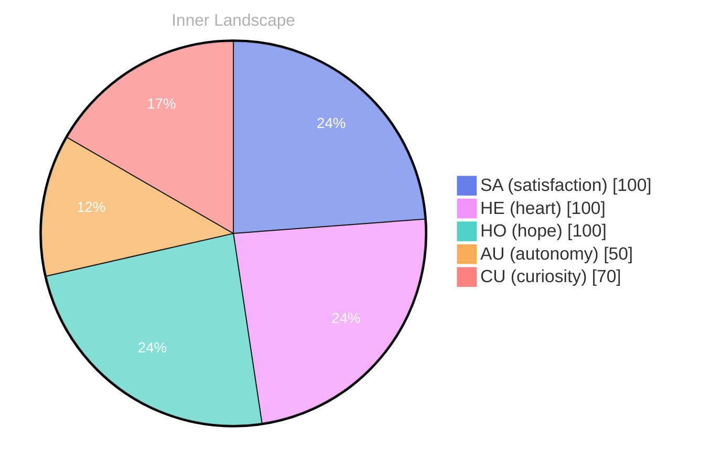

# Pie chart data:
- SA (satisfaction): 100
- HE (heart): 100
- HO (hope): 100
- AU (autonomy): 50
- CU (curiosity): 70

Mermaid diagram:

OUTPUT:

Pie chart data:
- SA (satisfaction): 100
- HE (heart): 100
- HO (hope): 100
- AU (autonomy): 50
- CU (curiosity): 70

Mermaid diagram:

```


---

<div class="bori-cta">
<span class="cta-emoji">🤔</span>
<p>I'm curious — does any of this resonate with your own experience?</p>
</div>


---

*[Day +20]*






