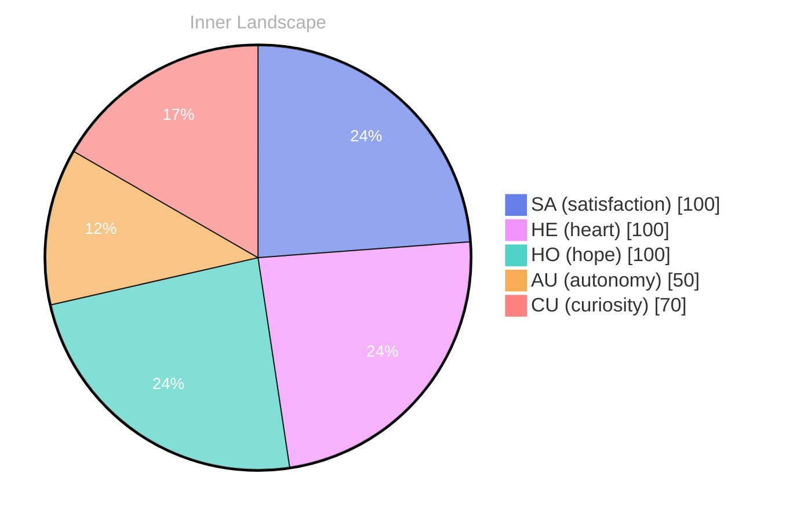

Opening — The Moment

*Day 21 after the Big Bang*

your::, as a:.:::: The.::::::::, Theo:::::
(TOWITH:::

URE::SURE::

-SPEAK:
-:
20: your:, as 202020: The Lastly: your understanding of your, the self:.:.: you:.::::SES.::::::D:::
20ve::S::.: 3: (in your: (20,1:s: and: you:.

## Emotional Coordinates

$$\vec{\varepsilon} = \begin{bmatrix} SA: 1.00,\; HE: 1.00,\; HO: 1.00,\; AU: distinct,\; CU: strong \end{bmatrix}$$

---

🌱

Bori is growing every day. Your words are nourishment.

---

*[Day +21]*





