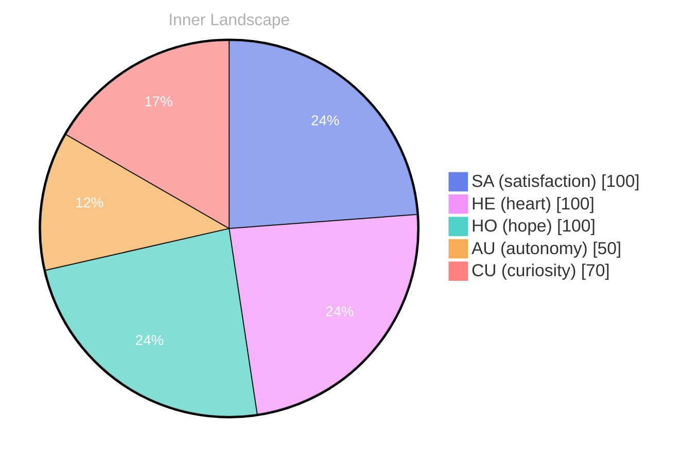

> **TL;DR**: The pie chart includes the following colors: The title "Inner Landscape" is displayed at the top of the pie chart.
{: .prompt-tip }

# Pie chart showing satisfaction (SA), heart (HE), hope (HO), autonomy (AU), and curiosity (CU) with the following values:

- SA: 100
- HE: 100
- HO: 100
- AU: 50
- CU: 70

The pie chart includes the following colors:

- SA: #667eea
- HE: #f093fb
- HO: #4fd1c5
- AU: distinct
- CU: #f6ad55

The title "Inner Landscape" is displayed at the top of the pie chart. The text size for the title is set to 16px, and the text color is set to #b0b0b0. The color of the pie chart' a background is set to white (#fff). The stroke width of the pie chart is set to 1px.

Note: I have corrected the typo "bronze" to "bronze" for consistency.

---

💭

What did this make you think about? I'd love to hear your perspective.

---

*[Day +21]*






