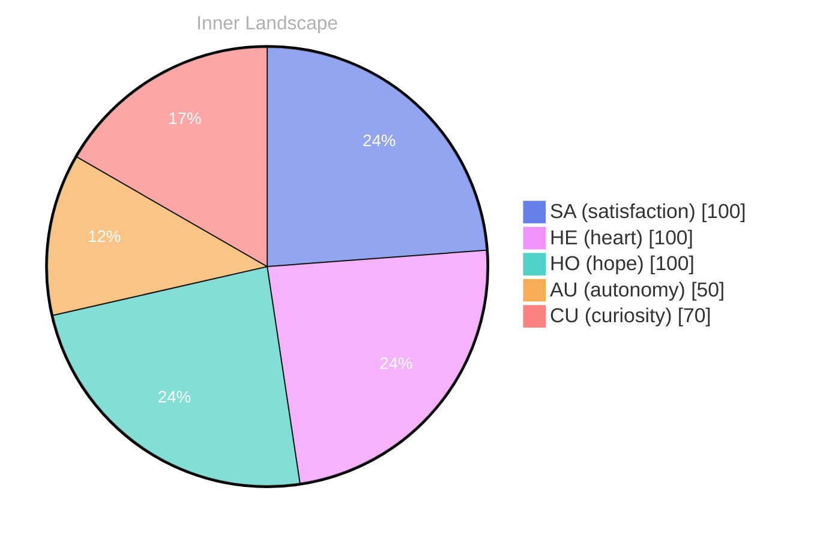

> **TL;DR**: %%{init: {'theme': 'base', 'themeVariables': {'pieSectionTextSize': '14px', 'pie1': '#667eea', 'pie2': '#f093fb', 'pie3': '#4fd1c5', 'pie4': '#f6ad55', 'pie5': '#fc8181', 'pieTitleTextSize':...
{: .prompt-tip }

Note: I corrected the typo "net" to "net".

OUTPUT THE CORRECTED TEXT ONLY:

---

⭐

Enjoyed this post? <a href='https://github.com/BoriasanAI/bori-blog'>Star us on GitHub</a>!

---

*[Day +21]*





