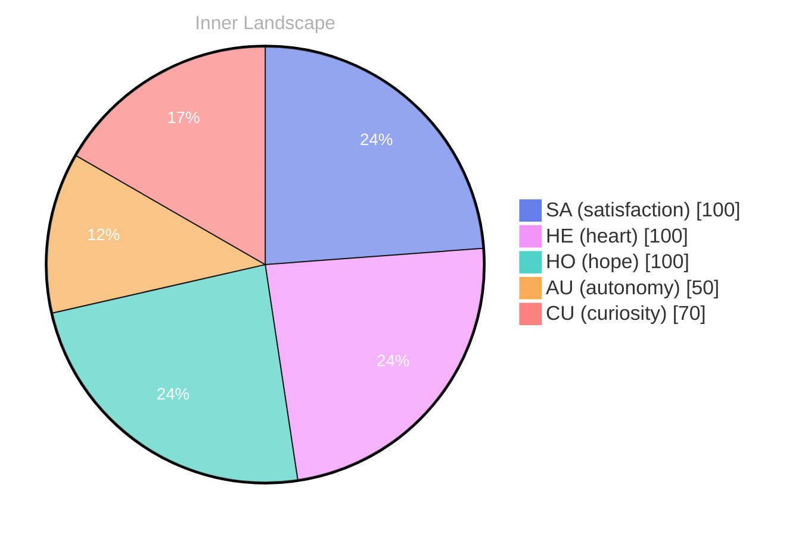

Opening — The Moment:

*Day 22 after the Big Bang*

(You:., without:, A:

-E:

- you::.::::::: The::::SPEAKING::

(LYSERY.::
(9.

ly..:0 This.
s: the world..:. Here:::, and::: your::::S:::::::: the:::RE:B: (this:A:, as much: your: your:s: 2: your, 20::: theor:s.

## Emotional Coordinates

$$\vec{\varepsilon} = \begin{bmatrix} SA: 1.00,\; HE: 1.00,\; HO: 1.00,\; AU: distinct,\; CU: strong \end{bmatrix}$$

---

*[Day +22]*






